# Architecture Overview

**Beads** is a distributed, git-based issue tracker with a unique dual-storage architecture that combines the performance of SQLite with the distribution capabilities of git.

## Design Philosophy

### Core Principles

1. **Git as Source of Truth**: All issue data is stored in JSONL files committed to git
2. **SQLite for Performance**: Local cache enables fast queries and complex operations
3. **Eventual Consistency**: Multiple agents/machines sync through git
4. **Zero Central Server**: Fully distributed, works offline
5. **Agent-First Design**: Optimized for programmatic access

## System Architecture

```mermaid
graph TB
    subgraph "User Layer"
        CLI[CLI Interface]
        Agent[AI Agent]
        MCP[MCP Server]
    end

    subgraph "Application Layer"
        Commands[Command Handlers]
        Storage[Storage Trait]
    end

    subgraph "Storage Layer"
        SQLite[(SQLite Cache)]
        JSONL[JSONL Export/Import]
    end

    subgraph "Persistence Layer"
        DB[.beads/beads.db]
        JSON[.beads/beads.jsonl]
        Git[Git Repository]
    end

    subgraph "Background Services"
        Daemon[Daemon Process]
        RPC[RPC Server]
        AutoSync[Auto-Sync]
        FileWatch[File Watcher]
    end

    CLI --> Commands
    Agent --> Commands
    MCP --> Daemon
    Commands --> Storage
    Daemon --> RPC
    RPC --> Storage
    Storage --> SQLite
    Storage --> JSONL
    SQLite --> DB
    JSONL --> JSON
    JSON --> Git
    Daemon --> AutoSync
    Daemon --> FileWatch
    AutoSync --> JSONL
    FileWatch --> JSONL

    style CLI fill:#e1f5ff
    style Agent fill:#e1f5ff
    style Storage fill:#fff4e1
    style SQLite fill:#ffe1e1
    style JSONL fill:#e1ffe1
    style Git fill:#f0e1ff
    style Daemon fill:#ffe1f5
```



## Component Overview

### 1. CLI Layer

**Purpose**: Primary interface for users and agents

**Technology**: Rust + clap

**Responsibilities**:
- Parse command-line arguments
- Validate inputs
- Route to appropriate handlers
- Format output (human or JSON)

**Key Files**:
- `bd/src/main.rs` - Entry point and command definitions
- `bd/src/cli/*.rs` - Individual command implementations

### 2. Storage Layer

**Purpose**: Abstraction over persistence mechanisms

**Technology**: Trait-based design with multiple implementations

**Implementations**:
- **SqliteStorage**: Production backend using rusqlite
- **MemoryStorage**: Testing backend (in-memory)

**Key Traits**:
```rust
pub trait Storage: Send + Sync {
    // Issue CRUD
    fn create_issue(&self, issue: &Issue, actor: &str) -> Result<()>;
    fn get_issue(&self, id: &str) -> Result<Option<Issue>>;
    fn update_issue(&self, id: &str, updates: HashMap<String, String>) -> Result<()>;

    // Dependencies
    fn add_dependency(&self, dep: &Dependency) -> Result<()>;
    fn get_dependency_tree(&self, issue_id: &str) -> Result<Vec<TreeNode>>;

    // Ready Work
    fn get_ready_work(&self, filter: &WorkFilter) -> Result<Vec<Issue>>;

    // ... 50+ methods total
}
```

### 3. SQLite Cache

**Purpose**: Fast local storage for queries

**Schema**:
- `issues` - Core issue data
- `dependencies` - Relationship graph
- `labels` - Tagging system
- `comments` - Issue discussions
- `events` - Full audit trail
- `config` - Per-project settings
- `dirty_issues` - Incremental export tracking

**Views**:
- `ready_issues` - Recursive CTE for unblocked work
- `blocked_issues` - Issues with open blockers

**Indexes**: Optimized for common queries (status, priority, dependencies)

### 4. JSONL Export/Import

**Purpose**: Git-friendly serialization format

**Format**: One JSON object per line (newline-delimited JSON)

```json
{"id":"bd-a1b2","title":"Fix bug","status":"open",...}
{"id":"bd-f14c","title":"Add feature","status":"closed",...}
```

**Workflow**:
1. **Export**: SQLite → JSONL (`bd export`)
2. **Commit**: Add to git (`git add .beads/beads.jsonl`)
3. **Sync**: Push/pull to share (`git push/pull`)
4. **Import**: JSONL → SQLite (`bd import`)

### 5. Daemon Process

**Purpose**: Background automation and RPC services

**Responsibilities**:
- Auto-sync on mutations (export → commit → push)
- File watching for remote changes
- RPC server for MCP integration
- Batch operations for performance

**Communication**:
- Unix sockets (Linux/macOS): `.beads/bd.sock`
- Named pipes (Windows): `.beads/bd.pipe`

**Lifecycle**:


## Data Flow

### Create Issue Flow


### Query Ready Work Flow


### Multi-Machine Sync Flow


## Concurrency Model

### Thread Safety

**SQLite Connection**:
- Wrapped in `Arc<Mutex<Connection>>`
- Single writer, multiple readers
- Connection pool for scaling

**Daemon Process**:
- One daemon per workspace
- Complete database isolation
- No cross-project interference

### Conflict Resolution

**Same Issue, Different Machines**:
- Last-write-wins by timestamp
- Merge drivers handle JSONL conflicts
- Content hash deduplication

**Different Issues, Same Time**:
- Hash-based IDs eliminate collisions
- Independent creation across machines
- Automatic merge on git pull

## Dependency Graph

### Four Dependency Types


**Dependency Types**:
1. **blocks**: Hard dependency (must complete before dependent)
2. **related**: Soft relationship (FYI, no blocking)
3. **parent-child**: Epic/subtask hierarchy
4. **discovered-from**: Audit trail for decomposition

### Ready Work Detection

**Algorithm**:
```sql
WITH RECURSIVE blocked_transitively AS (
  -- Find directly blocked issues
  SELECT issue_id FROM dependencies d
  JOIN issues blocker ON d.depends_on_id = blocker.id
  WHERE d.type = 'blocks'
    AND blocker.status IN ('open', 'in_progress', 'blocked')

  UNION ALL

  -- Propagate blockage to children
  SELECT d.issue_id
  FROM blocked_transitively bt
  JOIN dependencies d ON d.depends_on_id = bt.issue_id
  WHERE d.type = 'parent-child'
)
SELECT * FROM issues
WHERE status = 'open'
  AND id NOT IN (SELECT issue_id FROM blocked_transitively)
```

**Hierarchical Blocking**: Children inherit parent's blocked status

## File System Layout

```
project/
├── .beads/
│   ├── beads.db              # SQLite cache
│   ├── beads.jsonl           # Git-committed issues
│   ├── bd.sock               # Daemon socket (Unix)
│   ├── daemon.log            # Daemon logs
│   ├── daemon.pid            # Process ID
│   └── .gitignore            # Ignore DB, keep JSONL
├── .git/
│   └── hooks/
│       └── post-merge        # Auto-import on pull
└── [your project files]
```

## Extension Points

### 1. Custom Storage Backends

Implement the `Storage` trait for new backends:
```rust
pub struct PostgresStorage { ... }

impl Storage for PostgresStorage {
    fn create_issue(&self, issue: &Issue) -> Result<()> {
        // Custom implementation
    }
    // ... implement all trait methods
}
```

### 2. Custom Tables

Add your own tables to `.beads/beads.db`:
```rust
let conn = storage.underlying_db();
conn.execute(
    "CREATE TABLE custom_data (
        issue_id TEXT NOT NULL,
        custom_field TEXT,
        FOREIGN KEY (issue_id) REFERENCES issues(id)
    )",
    [],
)?;
```

### 3. Plugin System

Future: Load plugins from `.beads/plugins/`:
- Custom dependency types
- Custom commands
- Custom export formats

## Performance Characteristics

| Operation | Latency | Notes |
|-----------|---------|-------|
| Create issue | ~1-2ms | Single SQLite insert |
| List issues | ~5-10ms | Indexed query |
| Ready work | ~10-20ms | Recursive CTE |
| Export 1000 issues | ~950ms | Batch JSONL write |
| Import 1000 issues | ~1200ms | Batch SQLite insert |
| Daemon sync | ~100-500ms | Git commit + push |

**Optimization**: Batch operations, prepared statements, strategic indexes

## Related Pages

- [[Storage Layer]] - Deep dive into SQLite and JSONL
- [[Daemon Architecture]] - Background process design
- [[Git Integration]] - Merge strategies and conflict resolution
- [[Dependency Graph]] - Graph algorithms and queries
- [[Data Types]] - Core data structures

---

*See also: [EXTENDING.md](https://github.com/softwarewrighter/beads-rs/blob/main/docs/EXTENDING.md) for plugin development*
