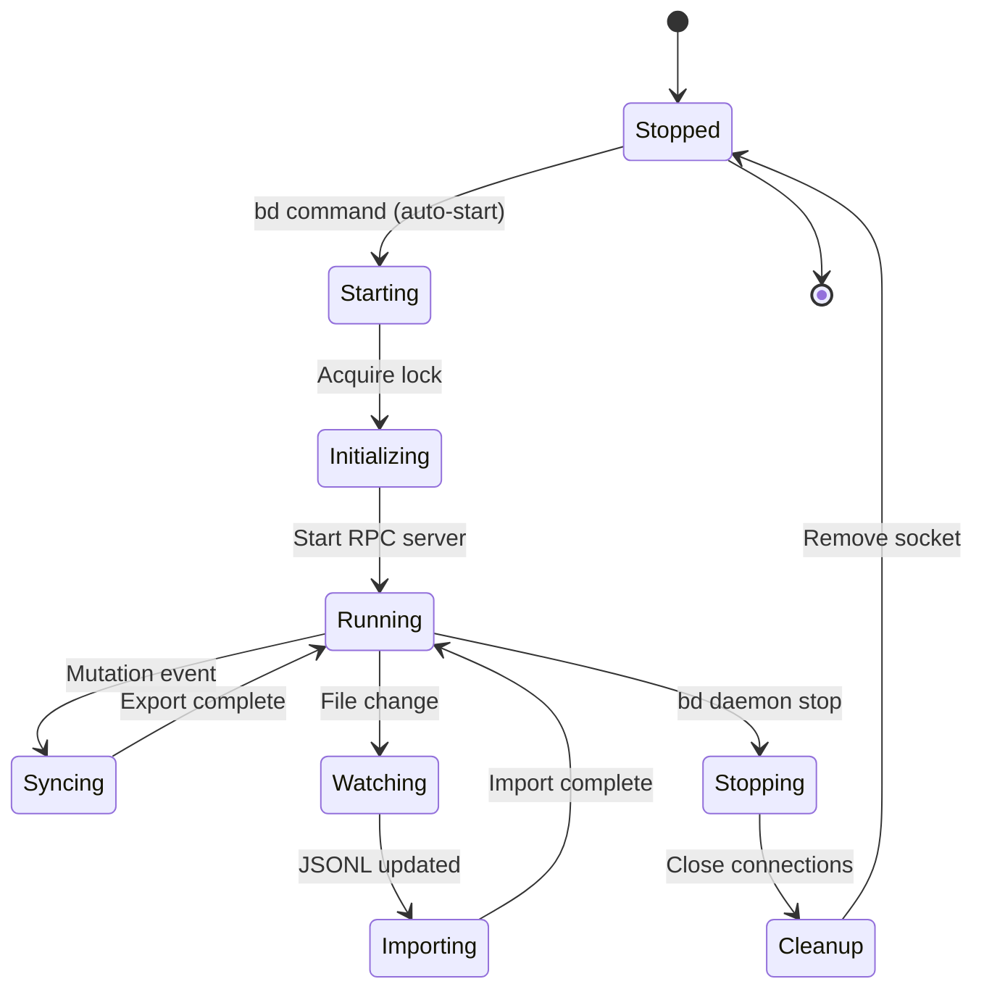
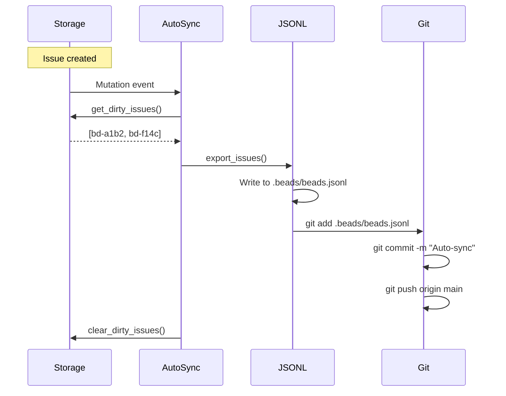
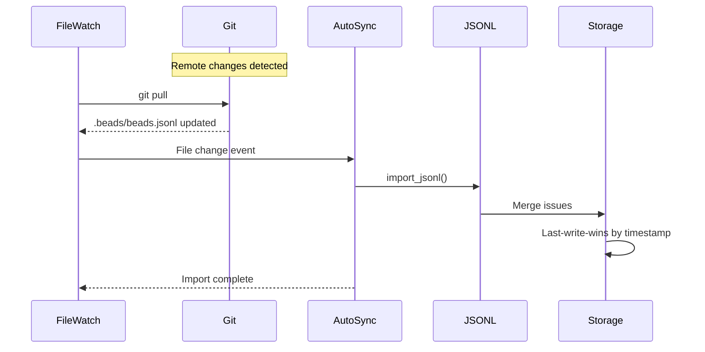

# Daemon Architecture

The Beads daemon is a background process that provides auto-sync, RPC services, and file watching for real-time synchronization.

## Architecture

```mermaid
graph TB
    subgraph "Daemon Process"
        Main[Main Loop]
        RPC[RPC Server]
        FileWatch[File Watcher]
        AutoSync[Auto-Sync Engine]
        EventBus[Event Bus]
    end

    subgraph "Communication"
        Socket[Unix Socket / Named Pipe]
        CLI[CLI Client]
        MCP[MCP Server]
    end

    subgraph "Storage"
        Storage[Storage Layer]
        SQLite[(SQLite)]
        JSONL[JSONL Files]
    end

    subgraph "Git"
        Git[Git Commands]
        Remote[Git Remote]
    end

    CLI --> Socket
    MCP --> Socket
    Socket --> RPC
    RPC --> EventBus
    FileWatch --> EventBus
    EventBus --> AutoSync
    AutoSync --> Storage
    AutoSync --> JSONL
    JSONL --> Git
    Git --> Remote
    Storage --> SQLite

    style Main fill:#ffe1f5
    style RPC fill:#e1f5ff
    style AutoSync fill:#e1ffe1
    style Git fill:#f0e1ff
```

## Per-Workspace Model

**One daemon per workspace** (LSP-style):

```
/home/user/projects/
├── webapp/
│   └── .beads/
│       ├── bd.sock          # Daemon 1
│       ├── daemon.pid       # PID file
│       └── daemon.log       # Logs
└── backend/
    └── .beads/
        ├── bd.sock          # Daemon 2
        ├── daemon.pid
        └── daemon.log
```

**Benefits**:
- Complete database isolation
- No cross-project pollution
- Independent version management
- Parallel operation

## Daemon Lifecycle



## Auto-Start Mechanism

### Trigger

```rust
// CLI detects no daemon running
if !daemon_client.ping() {
    if auto_start_enabled() {
        spawn_daemon(workspace_path);
        wait_for_socket(timeout: 5s);
    }
}
```

### Spawn Process

```bash
# Daemon command
bd daemon start --workspace /path/to/workspace --detach

# Detach from terminal
nohup bd daemon run > .beads/daemon.log 2>&1 &
echo $! > .beads/daemon.pid
```

### Socket Creation

```rust
let socket_path = workspace.join(".beads/bd.sock");
let listener = UnixListener::bind(&socket_path)?;

// Wait for client connections
loop {
    let (stream, _) = listener.accept()?;
    handle_client(stream);
}
```

## RPC Protocol

### Commands

| RPC Command | Purpose | Returns |
|-------------|---------|---------|
| `ping` | Health check | `pong` |
| `create_issue` | Create via daemon | Issue ID |
| `get_issue` | Fetch issue | Issue JSON |
| `sync` | Manual sync trigger | Status |
| `export` | Force export | Export count |
| `import` | Force import | Import count |
| `shutdown` | Graceful shutdown | OK |

### Message Format

```json
{
  "jsonrpc": "2.0",
  "id": 1,
  "method": "create_issue",
  "params": {
    "issue": { ... },
    "actor": "alice"
  }
}
```

### Response Format

```json
{
  "jsonrpc": "2.0",
  "id": 1,
  "result": {
    "issue_id": "bd-a1b2"
  }
}
```

## Auto-Sync Engine

### Export Flow



### Import Flow



### Batching Strategy

**Problem**: Avoid git commit storm
**Solution**: Batch mutations within time window

```rust
let mut batch = Vec::new();
let mut timer = Interval::new(Duration::from_secs(5));

loop {
    select! {
        event = event_rx.recv() => {
            batch.push(event);
        }
        _ = timer.tick() => {
            if !batch.is_empty() {
                export_batch(&batch);
                batch.clear();
            }
        }
    }
}
```

## File Watching

### Event-Driven Mode

```rust
let watcher = notify::recommended_watcher(move |event| {
    match event {
        Event::Modify(path) if path.ends_with("beads.jsonl") => {
            trigger_import();
        }
        _ => {}
    }
})?;

watcher.watch(".beads/beads.jsonl", RecursiveMode::NonRecursive)?;
```

### Polling Fallback

If file watching fails, fall back to polling:

```rust
let mut last_mtime = get_mtime(".beads/beads.jsonl")?;

loop {
    sleep(Duration::from_secs(5));
    let current_mtime = get_mtime(".beads/beads.jsonl")?;
    if current_mtime > last_mtime {
        trigger_import();
        last_mtime = current_mtime;
    }
}
```

## Version Management

### Automatic Version Checking

```rust
// On RPC connection
let daemon_version = daemon.get_version()?;
let cli_version = env!("CARGO_PKG_VERSION");

if daemon_version != cli_version {
    warn!("Version mismatch: daemon={}, cli={}", daemon_version, cli_version);
    daemon.shutdown()?;
    spawn_daemon(); // Auto-restart with new version
}
```

### Health Monitoring

```bash
# Check daemon health
bd daemons health --json

# Output
{
  "healthy": false,
  "issues": [
    {
      "workspace": "/home/user/projects/webapp",
      "issue": "version_mismatch",
      "daemon_version": "0.20.0",
      "cli_version": "0.21.0",
      "recommendation": "Restart daemon: bd daemons restart"
    }
  ]
}
```

## Thread Model

### Main Thread

- Event loop
- Socket accept()
- Dispatch to workers

### RPC Worker Pool

```rust
let pool = ThreadPool::new(4);

for stream in listener.incoming() {
    pool.execute(|| {
        handle_rpc_request(stream);
    });
}
```

### File Watch Thread

```rust
thread::spawn(|| {
    watch_filesystem();
});
```

### Auto-Sync Thread

```rust
thread::spawn(|| {
    auto_sync_loop();
});
```

## Configuration

### Environment Variables

```bash
# Disable daemon entirely
export BEADS_NO_DAEMON=1

# Disable auto-start (manual start only)
export BEADS_AUTO_START_DAEMON=false

# Custom socket path
export BEADS_SOCKET_PATH=/tmp/bd.sock

# Sync interval (seconds)
export BEADS_SYNC_INTERVAL=5
```

### Config File

```yaml
# .beads/config.yaml
daemon:
  auto_start: true
  sync_interval: 5
  file_watch: true
  log_level: info
  max_batch_size: 100
```

## Error Handling

### Git Push Failures

```rust
match git_push() {
    Ok(_) => clear_dirty_issues(),
    Err(e) if e.is_network_error() => {
        // Retry with exponential backoff
        retry_with_backoff(git_push, max_retries: 3);
    }
    Err(e) => {
        error!("Push failed: {}", e);
        // Keep dirty flags, retry later
    }
}
```

### RPC Timeouts

```rust
tokio::time::timeout(
    Duration::from_secs(30),
    handle_rpc_request(req)
).await?
```

### Socket Cleanup

```rust
// On shutdown
drop(listener);
fs::remove_file(&socket_path)?;
fs::remove_file(&pid_file)?;
```

## Performance Metrics

| Metric | Target | Actual |
|--------|--------|--------|
| RPC latency | <10ms | ~3-5ms |
| Auto-sync latency | <500ms | ~100-300ms |
| File watch latency | <100ms | ~20-50ms |
| Memory usage | <50MB | ~20-30MB |
| CPU idle | <1% | ~0.2% |

## Debugging

### View Logs

```bash
# Tail daemon logs
bd daemons logs . -f

# Search for errors
bd daemons logs . -n 1000 | grep ERROR

# Export sync issues
bd daemons logs . | grep "export\|import"
```

### Socket Inspection

```bash
# Check socket exists
ls -l .beads/bd.sock

# Test RPC connection
echo '{"jsonrpc":"2.0","method":"ping","id":1}' | \
  nc -U .beads/bd.sock
```

### Process Inspection

```bash
# Check daemon running
ps aux | grep "bd daemon"

# Check PID file
cat .beads/daemon.pid

# Kill stale daemon
kill $(cat .beads/daemon.pid)
```

## Limitations

### Git Worktrees

**Problem**: Daemon doesn't work with git worktrees

**Reason**: Shared `.beads/` directory across worktrees

**Solution**: Use `--no-daemon` flag for worktree workflows

### Network Partitions

**Problem**: Git push fails during network outage

**Solution**:
- Dirty flags preserved
- Automatic retry on reconnect
- Manual `bd sync` to force retry

## Related Pages

- [[Architecture Overview]] - System design
- [[Storage Layer]] - SQLite and JSONL
- [[Git Integration]] - Sync strategies
- [[CLI Commands]] - Command reference

---

*See also: [DAEMON.md](https://github.com/softwarewrighter/beads-rs/blob/main/docs/DAEMON.md) for operational guide*
