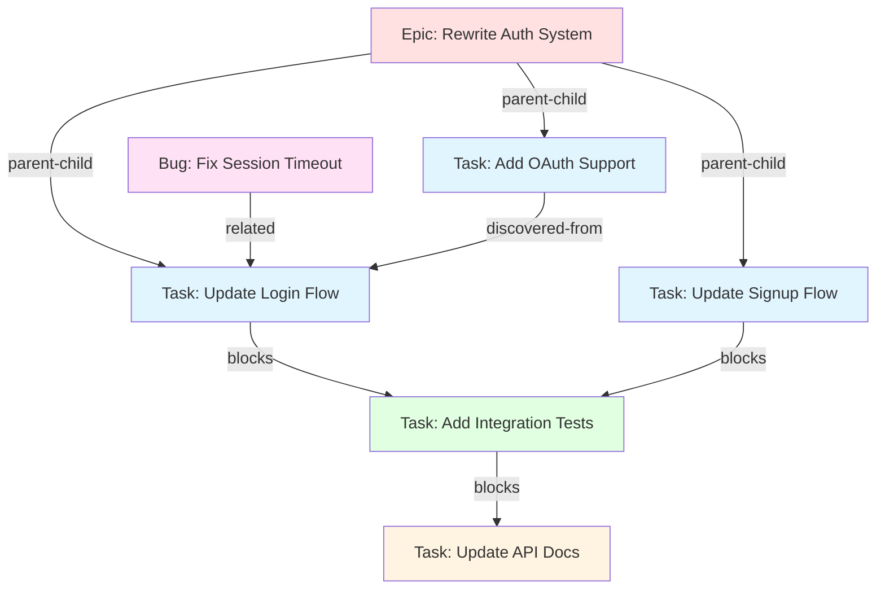
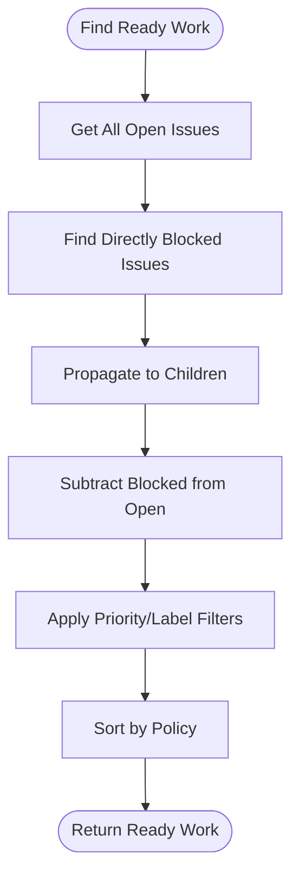
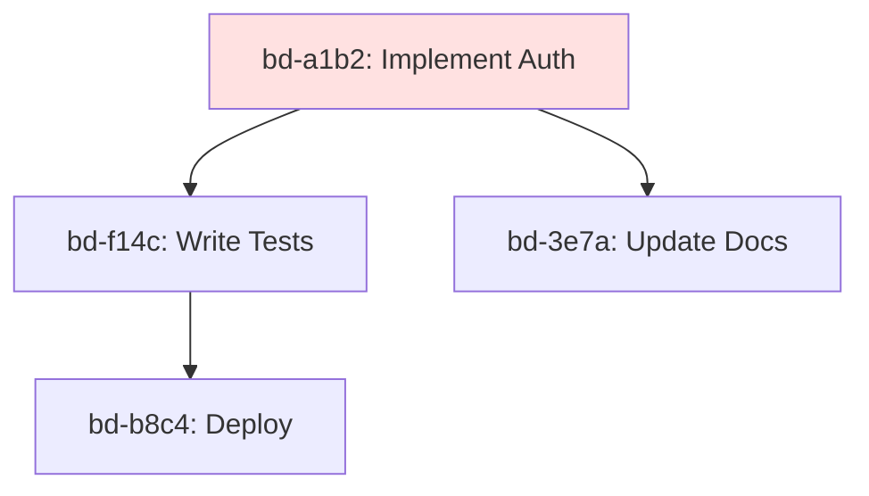
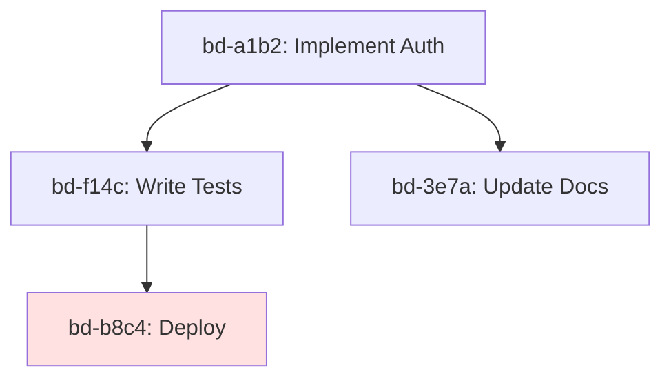

# Dependency Graph

Beads uses a sophisticated dependency graph with four relationship types to model complex task hierarchies.

## Four Dependency Types



### 1. blocks (Hard Dependency)

**Purpose**: Task A must be completed before Task B can start

**Example**:
- "Implement API endpoint" blocks "Write API tests"
- "Fix critical bug" blocks "Deploy to production"

**Semantics**:
- Blocker must be `closed` for dependent to be ready
- Transitive: If A blocks B and B blocks C, then A blocks C
- Used by ready work detection

### 2. related (Soft Relationship)

**Purpose**: FYI relationship, no blocking

**Example**:
- "Update documentation" related to "Implement feature"
- "Bug report" related to "Feature that caused it"

**Semantics**:
- No impact on ready work
- Useful for context and discovery
- Bidirectional navigation

### 3. parent-child (Hierarchy)

**Purpose**: Epic/subtask decomposition

**Example**:
- Epic "Rewrite Auth" has children: "Update Login", "Update Signup"
- Task "Implement Feature" has children: "Frontend", "Backend", "Tests"

**Semantics**:
- Child IDs: `bd-a1b2.1`, `bd-a1b2.2`
- Blocking propagates: If parent blocked, all children blocked
- Epic closure: Close when all children closed

### 4. discovered-from (Audit Trail)

**Purpose**: Track where new work was discovered

**Example**:
- "Fix edge case" discovered-from "Implement login"
- "Performance optimization" discovered-from "Load testing"

**Semantics**:
- Audit trail for decomposition
- No blocking semantics
- Useful for understanding work evolution

## Graph Operations

### Ready Work Detection

**Algorithm**: Find open issues with no open blockers (transitively)



**SQL Implementation**:
```sql
WITH RECURSIVE
  blocked_directly AS (
    SELECT DISTINCT d.issue_id
    FROM dependencies d
    JOIN issues blocker ON d.depends_on_id = blocker.id
    WHERE d.type = 'blocks'
      AND blocker.status IN ('open', 'in_progress', 'blocked')
  ),
  blocked_transitively AS (
    SELECT issue_id, 0 as depth FROM blocked_directly
    UNION ALL
    SELECT d.issue_id, bt.depth + 1
    FROM blocked_transitively bt
    JOIN dependencies d ON d.depends_on_id = bt.issue_id
    WHERE d.type = 'parent-child' AND bt.depth < 50
  )
SELECT i.*
FROM issues i
WHERE i.status = 'open'
  AND i.id NOT IN (SELECT issue_id FROM blocked_transitively)
ORDER BY priority DESC, created_at ASC
```

### Dependency Tree Traversal

**Forward Traversal** (what depends on this?):



**Reverse Traversal** (what does this depend on?):



### Cycle Detection

**Problem**: Prevent circular dependencies (A → B → C → A)

**Algorithm**: Depth-first search with visited tracking

```rust
fn detect_cycles(&self) -> Result<Vec<Vec<String>>> {
    let mut cycles = Vec::new();
    let mut visited = HashSet::new();
    let mut path = Vec::new();

    for issue in self.get_all_issues()? {
        if !visited.contains(&issue.id) {
            dfs(&issue.id, &mut visited, &mut path, &mut cycles);
        }
    }

    Ok(cycles)
}

fn dfs(
    issue_id: &str,
    visited: &mut HashSet<String>,
    path: &mut Vec<String>,
    cycles: &mut Vec<Vec<String>>,
) {
    if path.contains(&issue_id.to_string()) {
        // Found cycle!
        let cycle_start = path.iter().position(|id| id == issue_id).unwrap();
        cycles.push(path[cycle_start..].to_vec());
        return;
    }

    path.push(issue_id.to_string());
    visited.insert(issue_id.to_string());

    for dep in get_dependencies(issue_id) {
        if dep.dep_type == DependencyType::Blocks {
            dfs(&dep.depends_on_id, visited, path, cycles);
        }
    }

    path.pop();
}
```

**Prevention**: Reject dependency addition that creates cycle

```bash
# This would create a cycle
bd dep add bd-a1b2 --blocks bd-f14c   # OK
bd dep add bd-f14c --blocks bd-3e7a   # OK
bd dep add bd-3e7a --blocks bd-a1b2   # ERROR: Would create cycle
```

### Epic Closure Detection

**Algorithm**: Find epics eligible for closure (all children closed)

```sql
SELECT
    parent.id as epic_id,
    parent.title,
    COUNT(child.id) as total_children,
    SUM(CASE WHEN child.status = 'closed' THEN 1 ELSE 0 END) as closed_children
FROM issues parent
JOIN dependencies d ON parent.id = d.depends_on_id
JOIN issues child ON d.issue_id = child.id
WHERE parent.issue_type = 'epic'
  AND parent.status != 'closed'
  AND d.type = 'parent-child'
GROUP BY parent.id
HAVING COUNT(child.id) = SUM(CASE WHEN child.status = 'closed' THEN 1 ELSE 0 END)
```

## Graph Visualization

### Tree View

```bash
bd dep tree bd-a1b2

# Output:
bd-a1b2 Implement Auth (open, P1)
├── bd-a1b2.1 Update Login (in_progress, P1)
│   └── bd-f14c Add OAuth (open, P2)
├── bd-a1b2.2 Update Signup (open, P1)
└── bd-a1b2.3 Write Tests (open, P2)
    └── bd-3e7a Update Docs (open, P3)
```

### Reverse Tree

```bash
bd dep tree bd-3e7a --reverse

# Output:
bd-3e7a Update Docs (open, P3)
└── bd-a1b2.3 Write Tests (open, P2)
    └── bd-a1b2 Implement Auth (open, P1)
```

### Graph Metrics

```bash
bd stats --graph

# Output:
{
  "total_dependencies": 42,
  "blocks_dependencies": 28,
  "parent_child_dependencies": 10,
  "related_dependencies": 3,
  "discovered_from_dependencies": 1,
  "max_depth": 5,
  "avg_dependencies_per_issue": 1.2,
  "cycles_detected": 0
}
```

## Use Cases

### 1. Feature Development

```
Epic: Add User Dashboard
├── Task: Design UI mockups (blocks implementation)
├── Task: Implement backend API (blocks frontend)
├── Task: Implement frontend (blocks tests)
├── Task: Write tests (blocks deployment)
└── Task: Deploy to staging
```

### 2. Bug Triage

```
Bug: Login fails
├── Task: Reproduce locally (discovered-from bug)
├── Task: Write failing test (blocks fix)
├── Task: Implement fix (blocks testing)
└── Task: Verify fix (blocks deployment)
```

### 3. Refactoring

```
Epic: Refactor Auth Module
├── Task: Extract auth service (blocks migration)
├── Task: Migrate endpoints (blocks cleanup)
├── Task: Remove old code (blocks documentation)
└── Documentation: Update API docs
```

## Performance

### Graph Traversal Complexity

| Operation | Time | Space | Notes |
|-----------|------|-------|-------|
| Add dependency | O(1) | O(1) | Single INSERT |
| Get dependencies | O(n) | O(n) | JOIN query |
| Ready work | O(n + e) | O(n) | Recursive CTE |
| Cycle detection | O(n + e) | O(n) | DFS |
| Tree traversal | O(d * n) | O(d) | Depth-limited |

**n** = number of issues
**e** = number of edges
**d** = tree depth

### Optimization Strategies

1. **Materialized Views**: Cache ready work results
2. **Depth Limiting**: Cap tree traversal at 50 levels
3. **Batch Operations**: Add multiple dependencies in one transaction
4. **Index Strategy**: Compound indexes on (depends_on_id, type)

## Related Pages

- [[Architecture Overview]] - System design
- [[Storage Layer]] - Graph storage in SQLite
- [[CLI Commands]] - Dependency commands (`bd dep`)

---

*See also: [CLI_REFERENCE.md](https://github.com/softwarewrighter/beads-rs/blob/main/docs/CLI_REFERENCE.md) for dependency commands*
