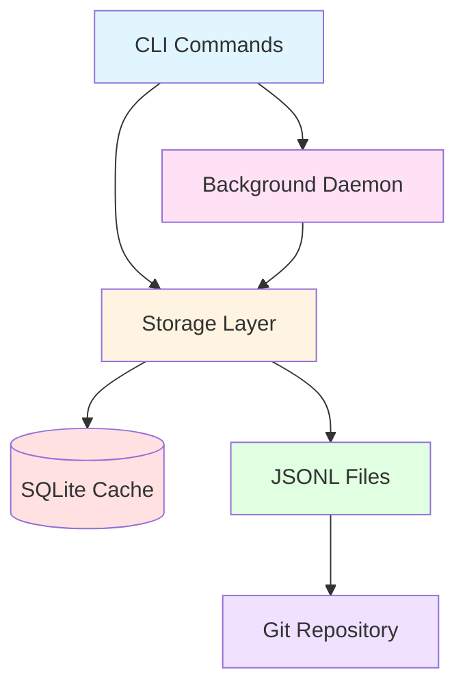

# Beads Issue Tracker Wiki

**Welcome to the Beads (bd) technical documentation!**

Beads is a lightweight, git-based issue tracker designed specifically for AI coding agents. It provides a distributed, dependency-aware memory system that enables agents to handle long-horizon tasks across multiple sessions.

## 🎯 Quick Navigation

### Getting Started
- [Installation Guide](https://github.com/softwarewrighter/beads-rs/blob/main/docs/INSTALLING.md)
- [Quickstart](https://github.com/softwarewrighter/beads-rs/blob/main/docs/QUICKSTART.md)
- [FAQ](https://github.com/softwarewrighter/beads-rs/blob/main/docs/FAQ.md)

### Architecture & Design
- [[Architecture Overview]] - System design and component interactions
- [[Storage Layer]] - SQLite + JSONL dual-storage architecture
- [[Daemon Architecture]] - Background process and RPC design
- [[Git Integration]] - Distributed synchronization via git
- [[Dependency Graph]] - Four dependency types and graph operations

### Implementation
- [[CLI Commands]] - Command-line interface design
- [[Rust Migration]] - Go to Rust conversion roadmap
- [[Data Types]] - Core types and validation
- [[Import Export]] - JSONL format and merge strategies

### Advanced Topics
- [[Multi Repo Support]] - Cross-repository dependency routing
- [[Protected Branches]] - Working with branch protection
- [[Agent Mail]] - Real-time multi-agent coordination
- [[Memory Compaction]] - Semantic issue compression

## 🏗️ Architecture at a Glance

## 🔑 Key Features

### Distributed by Design
- **Git-backed persistence**: JSONL records committed to git
- **SQLite performance**: Local cache for fast queries
- **Multi-machine sync**: Automatic synchronization via git pull/push
- **Conflict resolution**: Intelligent merge drivers for concurrent updates

### Dependency-Aware
- **Four dependency types**: blocks, related, parent-child, discovered-from
- **Ready work detection**: Automatically finds unblocked issues
- **Cycle detection**: Prevents circular dependencies
- **Tree visualization**: Full dependency graph traversal

### Agent-Friendly
- **JSON output**: `--json` flag on all commands
- **Batch operations**: Bulk import/export (1000 issues in ~950ms)
- **Audit trail**: Complete event history for all changes
- **Auto-discovery**: Finds `.beads/` database in parent directories

## 📊 System Components

| Component | Purpose | Technology |
|-----------|---------|------------|
| **CLI** | User/agent interface | Rust (clap) |
| **Storage** | Data persistence | rusqlite + JSONL |
| **Daemon** | Background sync | RPC server |
| **Git Integration** | Distribution | Git hooks + merge drivers |
| **Type System** | Data validation | Rust structs + serde |

## 🚀 Current Status

**Rust Migration**: ✅ In Progress

The project is being migrated from Go to Rust for improved type safety, performance, and memory safety.

### Completed
- ✅ Core data types (`Issue`, `Dependency`, `Comment`, `Event`)
- ✅ Storage trait interface
- ✅ SQLite implementation with schema
- ✅ CLI framework with clap
- ✅ Basic CRUD operations

### In Progress
- 🔨 JSONL import/export
- 🔨 Dependency tree operations
- 🔨 Ready work detection
- 🔨 Command implementations

### Planned
- 📋 Daemon RPC layer
- 📋 Git integration hooks
- 📋 Multi-repo routing
- 📋 Memory compaction

See [[Rust Migration]] for detailed progress.

## 📚 Documentation Structure

### Wiki Pages (Architecture & Design)
High-level system design, component interactions, and architectural decisions.

### Repository Docs (User Guides)
User-facing documentation, command references, and tutorials.
- [Documentation Directory](https://github.com/softwarewrighter/beads-rs/tree/main/docs)
- [Command Examples](https://github.com/softwarewrighter/beads-rs/tree/main/commands)

### Code Documentation
Inline Rust documentation (rustdoc) for implementation details.

## 🤝 Contributing

Interested in contributing? See:
- [Contributing Guide](https://github.com/softwarewrighter/beads-rs/blob/main/CONTRIBUTING.md)
- [Architecture Overview](Architecture-Overview) to understand the system design
- [Rust Migration](Rust-Migration) for current priorities

## 📞 Links

- **Main Repository**: https://github.com/softwarewrighter/beads-rs
- **Issue Tracker**: https://github.com/softwarewrighter/beads-rs/issues
- **Releases**: https://github.com/softwarewrighter/beads-rs/releases
- **Original Go Implementation**: https://github.com/steveyegge/beads

---

*Last updated: 2025-11-19*
