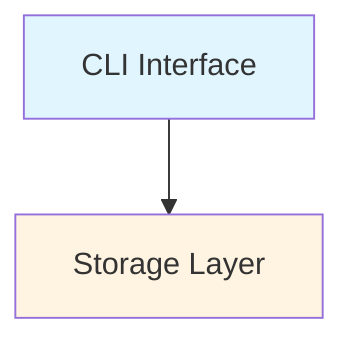

# Beads Wiki Pages

This directory contains the GitHub Wiki pages for the Beads project.

## Setup Instructions

### Option 1: Enable GitHub Wiki (Recommended)

1. Go to your GitHub repository settings
2. Enable the Wiki feature
3. Clone the wiki repository:
   ```bash
   git clone https://github.com/softwarewrighter/beads-rs.wiki.git
   ```
4. Copy all `.md` files from this directory to the wiki repo:
   ```bash
   cp wiki/*.md beads-rs.wiki/
   cd beads-rs.wiki
   git add .
   git commit -m "Add comprehensive wiki documentation"
   git push
   ```

### Option 2: Keep in Repository

The wiki pages can remain in this directory as reference documentation. They are written in standard Markdown and viewable directly on GitHub.

## Page Structure

### Core Pages

- **Home.md** - Main entry point with overview and navigation
- **_Sidebar.md** - Navigation sidebar (GitHub wiki special file)

### Architecture Documentation

- **Architecture-Overview.md** - System design with Mermaid diagrams
- **Storage-Layer.md** - SQLite + JSONL dual-storage design
- **Daemon-Architecture.md** - Background process and RPC
- **Dependency-Graph.md** - Four dependency types and graph algorithms
- **Rust-Migration.md** - Go to Rust conversion progress

### Link Formats

**Important**: Wiki pages use different link formats:

1. **Page-to-Page (Wiki Links)**:
   ```markdown
   [[Architecture Overview]]
   [[Storage Layer]]
   ```

2. **Wiki-to-Repo-Docs**:
   ```markdown
   [Installation](https://github.com/softwarewrighter/beads-rs/blob/main/docs/INSTALLING.md)
   [CLI Reference](https://github.com/softwarewrighter/beads-rs/blob/main/docs/CLI_REFERENCE.md)
   ```

3. **Sidebar Links**: Same format as page-to-page

## Mermaid Diagrams

All diagrams use Mermaid syntax. Key constraints:

- ✅ Use `graph`, `flowchart`, `sequenceDiagram`, `stateDiagram-v2`
- ✅ Use CSS-compatible colors: `fill:#e1f5ff`
- ❌ No HTML elements (no `<br>` tags)
- ❌ No HTML entities in labels

**Example**:


## Maintenance

### Adding New Pages

1. Create `New-Page-Name.md` (use kebab-case)
2. Add to `_Sidebar.md` navigation
3. Link from relevant pages using `[[New Page Name]]`

### Updating Diagrams

```bash
# Edit diagram in page
vim Architecture-Overview.md

# Test locally (if you have mermaid-cli)
mmdc -i Architecture-Overview.md -o preview.png

# Commit changes
git add Architecture-Overview.md
git commit -m "Update architecture diagram"
```

### Checking Links

```bash
# Find broken wiki links
grep -r '\[\[.*\]\]' wiki/*.md | while read line; do
  echo "$line"
done

# Find broken doc links
grep -r 'https://github.com/softwarewrighter/beads-rs' wiki/*.md
```

## Contributing

When adding documentation:

1. **Architecture changes**: Update relevant wiki pages
2. **New features**: Add to appropriate page or create new page
3. **Code examples**: Keep synchronized with actual code
4. **Diagrams**: Use Mermaid, avoid external images when possible

## Related Documentation

- `/docs/` - User-facing guides and tutorials
- `/commands/` - Individual command documentation
- `/examples/` - Code examples and demos
- This `/wiki/` - Architecture and design documentation

---

*For questions about wiki setup, see [GitHub Wiki Documentation](https://docs.github.com/en/communities/documenting-your-project-with-wikis)*
