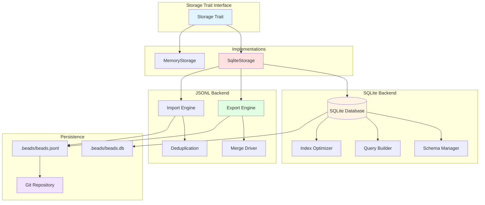
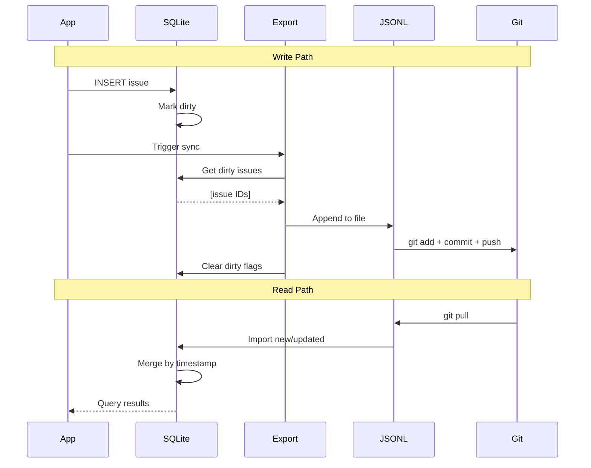
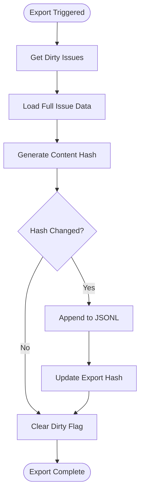
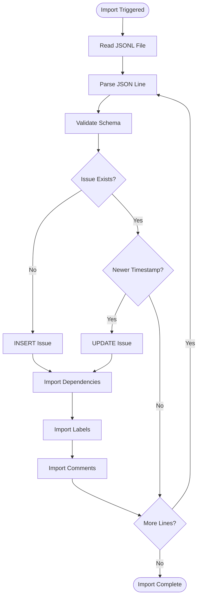

# Storage Layer

The Beads storage layer uses a **dual-storage architecture** combining SQLite for performance with JSONL for git-based distribution.

## Architecture



## Dual-Storage Design

### Why Two Storage Mechanisms?

| Requirement | SQLite | JSONL | Solution |
|-------------|--------|-------|----------|
| Fast queries | ✅ Yes | ❌ No | Use SQLite for queries |
| Git-friendly | ❌ No | ✅ Yes | Use JSONL for git |
| Indexes | ✅ Yes | ❌ No | Use SQLite indexes |
| Merge conflicts | ❌ Hard | ✅ Easy | Use JSONL for merge |
| Relationships | ✅ Foreign keys | ❌ No | Use SQLite for graph |
| Human-readable | ❌ Binary | ✅ Text | Use JSONL for inspection |

**Strategy**: SQLite as cache, JSONL as source of truth

### Synchronization Flow



## SQLite Schema

### Core Tables

#### issues

```sql
CREATE TABLE issues (
    id TEXT PRIMARY KEY,
    content_hash TEXT,
    title TEXT NOT NULL CHECK(length(title) <= 500),
    description TEXT NOT NULL DEFAULT '',
    design TEXT NOT NULL DEFAULT '',
    acceptance_criteria TEXT NOT NULL DEFAULT '',
    notes TEXT NOT NULL DEFAULT '',
    status TEXT NOT NULL DEFAULT 'open',
    priority INTEGER NOT NULL DEFAULT 2 CHECK(priority >= 0 AND priority <= 4),
    issue_type TEXT NOT NULL DEFAULT 'task',
    assignee TEXT,
    estimated_minutes INTEGER,
    created_at DATETIME NOT NULL DEFAULT CURRENT_TIMESTAMP,
    updated_at DATETIME NOT NULL DEFAULT CURRENT_TIMESTAMP,
    closed_at DATETIME,
    external_ref TEXT,
    compaction_level INTEGER DEFAULT 0,
    compacted_at DATETIME,
    compacted_at_commit TEXT,
    original_size INTEGER,
    source_repo TEXT DEFAULT '',
    CHECK ((status = 'closed') = (closed_at IS NOT NULL))
);

CREATE INDEX idx_issues_status ON issues(status);
CREATE INDEX idx_issues_priority ON issues(priority);
CREATE INDEX idx_issues_assignee ON issues(assignee);
CREATE INDEX idx_issues_created_at ON issues(created_at);
```

**Key Features**:
- `content_hash`: SHA256 for deduplication
- `closed_at` constraint: Enforces status consistency
- Strategic indexes: Optimized for common queries

#### dependencies

```sql
CREATE TABLE dependencies (
    issue_id TEXT NOT NULL,
    depends_on_id TEXT NOT NULL,
    type TEXT NOT NULL DEFAULT 'blocks',
    created_at DATETIME NOT NULL DEFAULT CURRENT_TIMESTAMP,
    created_by TEXT NOT NULL,
    PRIMARY KEY (issue_id, depends_on_id),
    FOREIGN KEY (issue_id) REFERENCES issues(id) ON DELETE CASCADE,
    FOREIGN KEY (depends_on_id) REFERENCES issues(id) ON DELETE CASCADE
);

CREATE INDEX idx_dependencies_issue ON dependencies(issue_id);
CREATE INDEX idx_dependencies_depends_on ON dependencies(depends_on_id);
CREATE INDEX idx_dependencies_depends_on_type ON dependencies(depends_on_id, type);
```

**Key Features**:
- Composite primary key: Prevents duplicate dependencies
- Cascading deletes: Maintains referential integrity
- Compound indexes: Optimized for traversal

#### events (Audit Trail)

```sql
CREATE TABLE events (
    id INTEGER PRIMARY KEY AUTOINCREMENT,
    issue_id TEXT NOT NULL,
    event_type TEXT NOT NULL,
    actor TEXT NOT NULL,
    old_value TEXT,
    new_value TEXT,
    comment TEXT,
    created_at DATETIME NOT NULL DEFAULT CURRENT_TIMESTAMP,
    FOREIGN KEY (issue_id) REFERENCES issues(id) ON DELETE CASCADE
);

CREATE INDEX idx_events_issue ON events(issue_id);
CREATE INDEX idx_events_created_at ON events(created_at);
```

**Event Types**:
- `created`, `updated`, `status_changed`
- `commented`, `closed`, `reopened`
- `dependency_added`, `dependency_removed`
- `label_added`, `label_removed`
- `compacted`

### Metadata Tables

#### dirty_issues (Incremental Export)

```sql
CREATE TABLE dirty_issues (
    issue_id TEXT PRIMARY KEY,
    marked_at DATETIME NOT NULL DEFAULT CURRENT_TIMESTAMP,
    FOREIGN KEY (issue_id) REFERENCES issues(id) ON DELETE CASCADE
);

CREATE INDEX idx_dirty_issues_marked_at ON dirty_issues(marked_at);
```

**Purpose**: Track which issues need export
**Workflow**:
1. Mutation marks issue dirty
2. Export reads dirty issues
3. Export clears dirty flags

#### export_hashes (Timestamp Deduplication)

```sql
CREATE TABLE export_hashes (
    issue_id TEXT PRIMARY KEY,
    content_hash TEXT NOT NULL,
    exported_at DATETIME NOT NULL DEFAULT CURRENT_TIMESTAMP,
    FOREIGN KEY (issue_id) REFERENCES issues(id) ON DELETE CASCADE
);
```

**Purpose**: Avoid re-exporting unchanged issues
**Strategy**: Compare current hash with last export hash

#### child_counters (Hierarchical IDs)

```sql
CREATE TABLE child_counters (
    parent_id TEXT PRIMARY KEY,
    last_child INTEGER NOT NULL DEFAULT 0,
    FOREIGN KEY (parent_id) REFERENCES issues(id) ON DELETE CASCADE
);
```

**Purpose**: Generate child IDs (bd-a1b2.1, bd-a1b2.2, ...)
**Thread-safe**: Atomic increment

### Views (Computed Queries)

#### ready_issues

```sql
CREATE VIEW ready_issues AS
WITH RECURSIVE
  blocked_directly AS (
    SELECT DISTINCT d.issue_id
    FROM dependencies d
    JOIN issues blocker ON d.depends_on_id = blocker.id
    WHERE d.type = 'blocks'
      AND blocker.status IN ('open', 'in_progress', 'blocked')
  ),
  blocked_transitively AS (
    SELECT issue_id, 0 as depth FROM blocked_directly
    UNION ALL
    SELECT d.issue_id, bt.depth + 1
    FROM blocked_transitively bt
    JOIN dependencies d ON d.depends_on_id = bt.issue_id
    WHERE d.type = 'parent-child' AND bt.depth < 50
  )
SELECT i.*
FROM issues i
WHERE i.status = 'open'
  AND NOT EXISTS (
    SELECT 1 FROM blocked_transitively WHERE issue_id = i.id
  );
```

**Algorithm**:
1. Find directly blocked issues (open blocker)
2. Propagate to children (parent-child hierarchy)
3. Return open issues not in blocked set

#### blocked_issues

```sql
CREATE VIEW blocked_issues AS
SELECT
    i.*,
    COUNT(d.depends_on_id) as blocked_by_count
FROM issues i
JOIN dependencies d ON i.id = d.issue_id
JOIN issues blocker ON d.depends_on_id = blocker.id
WHERE i.status IN ('open', 'in_progress', 'blocked')
  AND d.type = 'blocks'
  AND blocker.status IN ('open', 'in_progress', 'blocked')
GROUP BY i.id;
```

## JSONL Format

### Structure

**One issue per line** (newline-delimited JSON):

```json
{"id":"bd-a1b2","content_hash":"f4e3...","title":"Fix login bug","description":"Login fails with OAuth","design":"","acceptance_criteria":"","notes":"","status":"open","priority":1,"issue_type":"bug","assignee":"","estimated_minutes":null,"created_at":"2025-01-15T10:30:00Z","updated_at":"2025-01-15T10:30:00Z","closed_at":null,"external_ref":null,"compaction_level":0,"compacted_at":null,"compacted_at_commit":null,"original_size":0,"source_repo":"","labels":["auth","critical"],"dependencies":[{"issue_id":"bd-a1b2","depends_on_id":"bd-f14c","type":"blocks","created_at":"2025-01-15T10:35:00Z","created_by":"alice"}],"comments":[]}
{"id":"bd-f14c","content_hash":"a7b2...","title":"Add tests","description":"Unit tests for auth module","design":"","acceptance_criteria":"95% coverage","notes":"","status":"closed","priority":2,"issue_type":"task","assignee":"bob","estimated_minutes":120,"created_at":"2025-01-10T09:00:00Z","updated_at":"2025-01-14T16:45:00Z","closed_at":"2025-01-14T16:45:00Z","external_ref":null,"compaction_level":0,"compacted_at":null,"compacted_at_commit":null,"original_size":0,"source_repo":"","labels":["testing"],"dependencies":[],"comments":[{"id":1,"issue_id":"bd-f14c","author":"alice","text":"Great work!","created_at":"2025-01-14T17:00:00Z"}]}
```

### Export Process



**Optimizations**:
- Incremental: Only export dirty issues
- Deduplication: Skip if content hash unchanged
- Batch: Export multiple issues in one transaction

### Import Process



**Merge Strategy**:
- **Last-write-wins** by `updated_at` timestamp
- **Additive** for dependencies, labels, comments
- **Conflict markers** detected and rejected

## Content Hashing

### Purpose

1. **Deduplication**: Detect duplicate issues
2. **Export optimization**: Skip unchanged issues
3. **Merge detection**: Identify same-issue conflicts

### Algorithm

```rust
pub fn compute_content_hash(&self) -> String {
    let mut hasher = Sha256::new();

    // Hash substantive fields in stable order
    hasher.update(self.title.as_bytes());
    hasher.update(&[0u8]); // separator
    hasher.update(self.description.as_bytes());
    hasher.update(&[0u8]);
    hasher.update(self.design.as_bytes());
    hasher.update(&[0u8]);
    hasher.update(self.acceptance_criteria.as_bytes());
    hasher.update(&[0u8]);
    hasher.update(self.notes.as_bytes());
    hasher.update(&[0u8]);
    hasher.update(self.status.as_str().as_bytes());
    hasher.update(&[0u8]);
    hasher.update(format!("{}", self.priority).as_bytes());
    hasher.update(&[0u8]);
    hasher.update(self.issue_type.as_str().as_bytes());
    hasher.update(&[0u8]);
    hasher.update(self.assignee.as_bytes());
    hasher.update(&[0u8]);

    if let Some(ref external_ref) = self.external_ref {
        hasher.update(external_ref.as_bytes());
    }

    format!("{:x}", hasher.finalize())
}
```

**Excluded Fields**:
- `id` - Different IDs can have same content
- Timestamps - Content hash ignores when
- Compaction metadata - Not part of core content

## Storage Trait

### Interface

```rust
pub trait Storage: Send + Sync {
    // Issue CRUD
    fn create_issue(&self, issue: &Issue, actor: &str) -> Result<()>;
    fn get_issue(&self, id: &str) -> Result<Option<Issue>>;
    fn update_issue(&self, id: &str, updates: HashMap<String, String>, actor: &str) -> Result<()>;
    fn close_issue(&self, id: &str, reason: &str, actor: &str) -> Result<()>;
    fn delete_issue(&self, id: &str) -> Result<()>;

    // Dependency graph
    fn add_dependency(&self, dep: &Dependency, actor: &str) -> Result<()>;
    fn get_dependency_tree(&self, issue_id: &str, max_depth: i32) -> Result<Vec<TreeNode>>;
    fn detect_cycles(&self) -> Result<Vec<Vec<Issue>>>;

    // Query
    fn search_issues(&self, query: &str, filter: &IssueFilter) -> Result<Vec<Issue>>;
    fn get_ready_work(&self, filter: &WorkFilter) -> Result<Vec<Issue>>;
    fn get_blocked_issues(&self) -> Result<Vec<BlockedIssue>>;

    // Export/import
    fn get_dirty_issues(&self) -> Result<Vec<String>>;
    fn clear_dirty_issues_by_id(&self, issue_ids: &[String]) -> Result<()>;

    // ... 50+ methods total
}
```

### Implementations

#### SqliteStorage

**Thread Safety**:
```rust
pub struct SqliteStorage {
    conn: Arc<Mutex<Connection>>,
    path: PathBuf,
}
```

**Connection Lifecycle**:
1. Open on construction
2. Enable foreign keys
3. Initialize schema
4. Wrapped in Arc<Mutex<>> for thread safety

#### MemoryStorage

**Purpose**: Testing without filesystem I/O

**Implementation**: HashMap-based in-memory storage

## Performance Tuning

### Indexes

Strategic indexes for common queries:

```sql
-- Status filtering (bd list --status open)
CREATE INDEX idx_issues_status ON issues(status);

-- Priority sorting (bd ready)
CREATE INDEX idx_issues_priority ON issues(priority);

-- Dependency traversal (bd dep tree)
CREATE INDEX idx_dependencies_depends_on ON dependencies(depends_on_id);

-- Compound index for ready work
CREATE INDEX idx_dependencies_depends_on_type ON dependencies(depends_on_id, type);
```

### Batch Operations

**Export**:
- Batch 100 issues per transaction
- Prepared statements for INSERT
- Single fsync per batch

**Import**:
- Batch 1000 issues per transaction
- Prepared statements for INSERT/UPDATE
- Deferred foreign key checks

### Query Optimization

**Ready Work**:
- Recursive CTE with depth limit (50)
- Early termination on cycle detection
- Materialized view for common filters

**Blocked Issues**:
- JOIN optimization with covering indexes
- GROUP BY pushed down to SQLite
- COUNT aggregation in single pass

## Extension Points

### Custom Tables

Add your own tables with foreign keys:

```rust
let db = storage.underlying_db();
db.execute(
    "CREATE TABLE code_reviews (
        issue_id TEXT NOT NULL,
        reviewer TEXT NOT NULL,
        status TEXT NOT NULL,
        comments TEXT,
        FOREIGN KEY (issue_id) REFERENCES issues(id) ON DELETE CASCADE
    )",
    [],
)?;
```

### Custom Queries

Direct SQL access:

```rust
let conn = storage.underlying_db();
let mut stmt = conn.prepare(
    "SELECT i.* FROM issues i
     JOIN code_reviews cr ON i.id = cr.issue_id
     WHERE cr.status = 'approved'"
)?;
```

## Related Pages

- [[Architecture Overview]] - System design
- [[Daemon Architecture]] - Auto-sync implementation
- [[Git Integration]] - JSONL merge strategies
- [[Data Types]] - Issue, Dependency, Event structures

---

*See also: [EXTENDING.md](https://github.com/softwarewrighter/beads-rs/blob/main/docs/EXTENDING.md) for database extensions*
